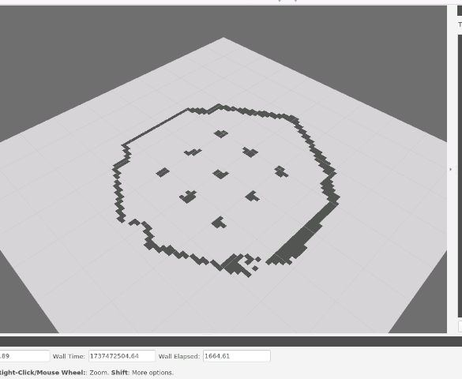
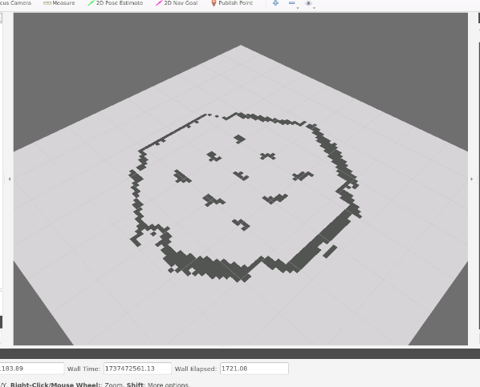
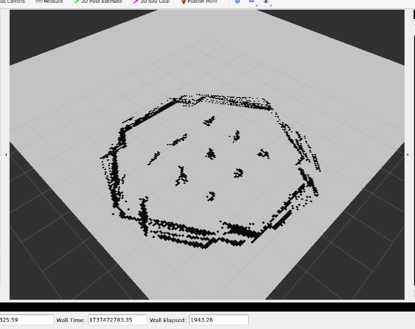
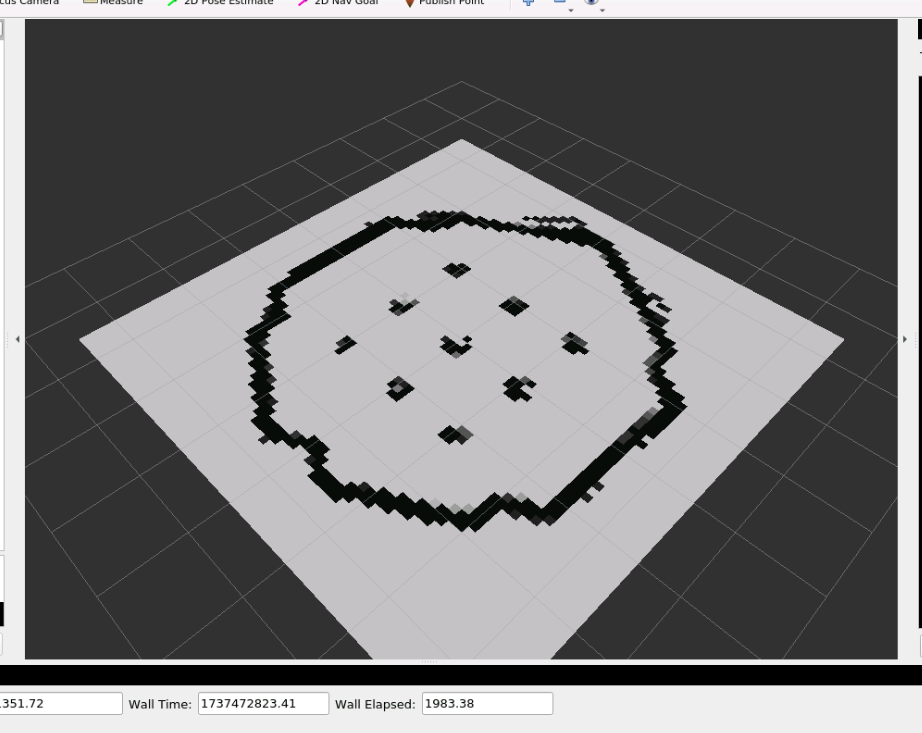

# **ROS-Based 2D Mapping and Wandering Robot System with TurtleBot3**

## **Overview**
This project demonstrates the implementation of a 2D mapping and autonomous wandering robot system using TurtleBot3 in the Robot Operating System (ROS). The robot explores an unknown environment autonomously, avoiding obstacles, while building a detailed occupancy grid map in real-time. The project focuses on dynamic mapping, probabilistic updates, and visualization in RViz.

---

## **Features**
- **Autonomous Navigation**: The robot navigates autonomously while avoiding obstacles using LiDAR-based sensor data.
- **2D Mapping**: Builds a real-time occupancy grid map using `/scan` and `/odom` data.
- **Dynamic Map Expansion**: Automatically adjusts the map size as the robot explores larger areas.
- **Probabilistic Updates**: Enhances map accuracy by considering sensor uncertainties.
- **Real-Time Visualization**: Visualizes the occupancy grid in RViz.

---

## **Project Structure**
```
ROS-Mapping-Wandering-Robot/
│
├── src/
│   ├── wandering_robot/
│   │   ├── src/
│   │   │   ├── wandering_robot.py
│   │   ├── CMakeLists.txt
│   │   ├── package.xml
│   │
│   ├── mapping/
│   │   ├── src/
│   │   │   ├── mapperv1.py
│   │   │   ├── mapperv2.py
│   │   │   ├── mapperv3.py
│   │   │   ├── mapperv4.py
│   │   ├── CMakeLists.txt
│   │   ├── package.xml
│   │
├── supporting_documents/
│   ├── screenshots/
│   │   ├── mapperv1_map.png
│   │   ├── mapperv2_map.png
│   │   ├── mapperv3_map.png
│   │   ├── mapperv4_map.png
│   ├── setup_instructions.pdf
│
├── README.md
```

---

## **Setup Instructions**

### **Step 1: Install Dependencies**
1. Clone the TurtleBot3 repositories:
   ```bash
   cd ~/catkin_ws/src
   git clone -b noetic-devel https://github.com/ROBOTIS-GIT/turtlebot3_msgs.git
   git clone -b noetic-devel https://github.com/ROBOTIS-GIT/turtlebot3.git
   git clone -b noetic-devel https://github.com/ROBOTIS-GIT/turtlebot3_simulations.git
   ```
2. Build the workspace:
   ```bash
   cd ~/catkin_ws
   catkin_make
   ```

---

### **Step 2: Run the Simulation**
1. Export the TurtleBot3 model:
   ```bash
   export TURTLEBOT3_MODEL=burger
   ```
2. Launch the Gazebo simulation:
   ```bash
   roslaunch turtlebot3_gazebo turtlebot3_world.launch
   ```
3. Open RViz for visualization:
   ```bash
   rosrun rviz rviz
   ```

---

### **Step 3: Run the Wandering Robot**
1. Run the `wandering_robot.py` script:
   ```bash
   rosrun wandering_robot wandering_robot.py
   ```

---

### **Step 4: Run the Mapping Nodes**
Run any of the mapping implementations in a separate terminal:
- **Basic Mapping (mapperv1):**
   ```bash
   rosrun mapping mapperv1.py
   ```
- **Mapping with Noise Filtering (mapperv2):**
   ```bash
   rosrun mapping mapperv2.py
   ```
- **Mapping with Dynamic Expansion (mapperv3):**
   ```bash
   rosrun mapping mapperv3.py
   ```
- **Mapping with Probabilistic Updates (mapperv4):**
   ```bash
   rosrun mapping mapperv4.py
   ```

---

## **Experiments and Results**

### **mapperv1: Basic Mapping**
- **Description**: Uses `/scan` and `/odom` to detect obstacles and update the map. Implements basic coordinate transformations and grid updates.
- **Limitations**: Works well for small environments but struggles with noise resilience and scalability.
- **Screenshot**:
  

---

### **mapperv2: Noise Filtering & Index Mapping**
- **Description**: Adds noise filtering to eliminate abrupt changes in laser scan data. Introduces the `get_index` method to convert global coordinates to grid indices for accurate updates.
- **Improvements**: Significantly reduces false positives and ensures smoother grid updates.
- **Screenshot**:
  

---

### **mapperv3: Dynamic Map Expansion**
- **Description**: Implements dynamic resizing of the occupancy grid to handle larger exploration areas. Preserves existing map data during expansion.
- **Improvements**: Allows the robot to explore beyond the initial grid boundary while retaining previously mapped data.
- **Screenshot**:
  

---

### **mapperv4: Probabilistic Mapping**
- **Description**: Updates grid cells probabilistically to reflect uncertainty in sensor readings. Uses clamped probabilities to represent obstacles and free space (values between 0 and 1).
- **Improvements**: Provides higher map accuracy and better representation of uncertain areas.
- **Screenshot**:
  

---

## **Conclusion**
This project demonstrates a systematic approach to building a robust 2D mapping system integrated with a wandering robot. Incremental improvements across four implementations ensure better scalability, accuracy, and noise resilience. The final implementation provides a probabilistic occupancy grid map, visualized in real-time using RViz. Future work could explore integrating SLAM for simultaneous localization and mapping.

---

## **References**
1. [How to Convert Quaternions to Euler Angles](https://www.theconstructsim.com/ros-qa-how-to-convert-quaternions-to-euler-angles/)
2. [nav\_msgs/OccupancyGrid Documentation](http://docs.ros.org/en/noetic/api/nav_msgs/html/msg/OccupancyGrid.html)
3. [RViz User Guide](https://wiki.ros.org/rviz/UserGuide)
4. *Learning Robotics Using Python - Second Edition* (Joseph Howse)
5. [ROS Navigation](https://risc.readthedocs.io/1-ros-navigation.html#mapping)
6. [ROS Gazebo Tutorials](http://gazebosim.org/tutorials)
7. [TurtleBot3 Documentation](https://emanual.robotis.com/docs/en/platform/turtlebot3/overview/)
